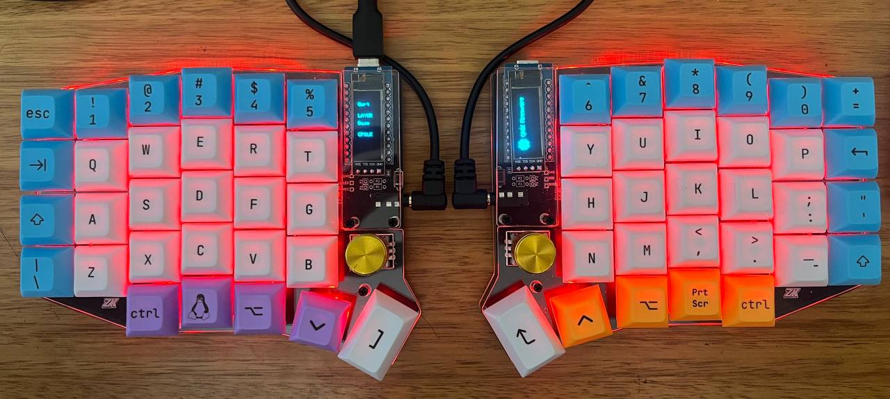

# requirements
create a venv using `python3 -m venv venv`

```shell
p -m pip install qmk && mqk setup
```

this will create a new folder in `~/qmt_firmware`. this folder contains different keyboars and default mappings. for my sofle keyboard, go to `~/qmt_formware/keyboards/sofle/keymaps`. the `rgb_default` folder contains the default kaymapping for a sofle keyboard. 

# compile and flash new keyboard mapping
## to start creating your own file using the default templates
just:
```shell
cd ~/qmk_firmware/keyboards/sofle/keymaps/<default_config>
```

```shell
mkdir my_keyboard && cp -r <default_config>/* my_keyboard
```

and start modifying your own `keymap.c` file. then compile and flash

## using config files in this repo 
go to the qmk firmware folder:
```shell
cd ~/qmk_firmware/keyboards/sofle/keymaps/<default_config>
```
and create a symbolic link to `my_keyboard` folder in this repo
```shell
ln -vs ~/Documents/qmk/my_keyboard ./my_keyboard
```

if you clone in a different folder, this might change a bit:
```shell
ln -vs ~<path_to_this_repo>/my_keyboard ./my_keyboard
```

## compile and flash
**note:** if you `python -m pip install qmk` be sure to activate the `venv` before running the following instructions:

first compile the keymap
```shell
qmk compule -kb sofle -km my_keyboard
```

then, using the usb-c cable connect only **one side** of the keyboard and flash it (**unplug the cable connecting both sides of the keyboard**):

```shell
qmk flash -km sofle -km my_keyboard
```

at some point, the terminal will ask to please press the keyboard reset button. do that and continue until the process is done.

then disconnect the usb-c cable from one side, and conenct it to the other side. flash it again:
```shell
qmk flash -km sofle -km my_keyboard
```

now you can plug the cable connecting both keyboard's parts and use your keyboard. you can check the keyboard mappin using [QMK configurator test](https://config.qmk.fm/#/test)

# resources
- for more info check [QMK tutorial](https://docs.qmk.fm/newbs)

# keyboard

